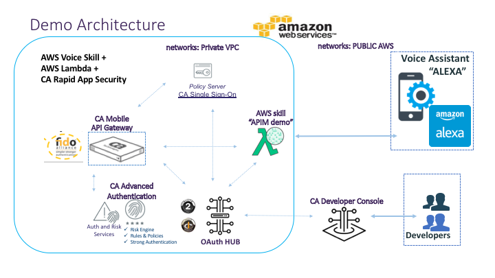
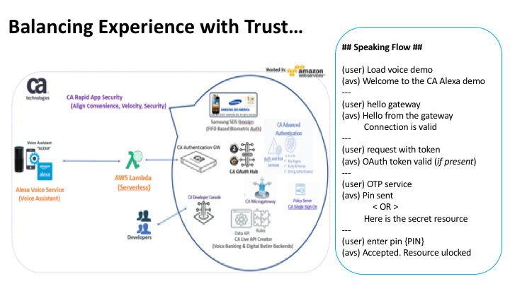

# CA APIM Demo: OAuth/JWT and OTP with Alexa Voice Service

This Amazon Alexa demo showcases the CA API OAuth solution
integrated with Lambda and OTP push notification using a personal Twillio Account.

#### [Alexa Developer Console](https://developer.amazon.com/alexa)
#### [AWS Developer Console](https://aws.amazon.com/)
#### [Twilio](https://www.twilio.com/)

## Directory Contents
### APIM_alexa_demo.pdf
    Reference Architecture and project set up slides
### lambdaExport
    Full export of Lambda function (zip)
### gwPolicy
    API gateway policy to be imported at path = `/alexa/*`
### alexaSkill
    Intent Schemas, Custom Slots and Sample Utterances
### JavaScript
    The JavaScript used in Lambda

## Demo Architecture

## Speaking Flow

